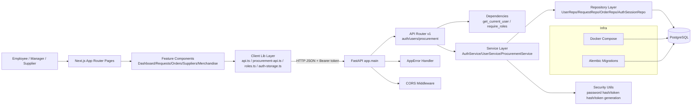
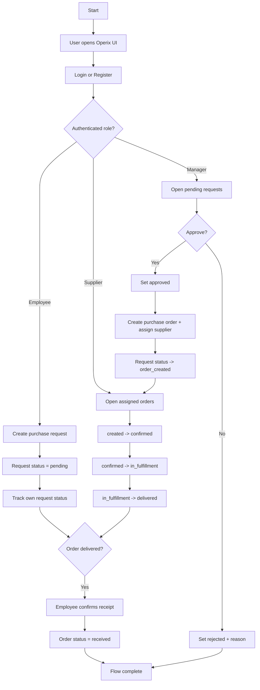

# Operix — Full Project Architecture

## 1. Purpose and Scope

This document describes the complete current architecture of the Operix MVP across backend, frontend, infrastructure, security boundaries, data model, and the main end-to-end user workflow.

Tech stack in use:
- **Backend:** Python, FastAPI, SQLAlchemy, Alembic, PostgreSQL
- **Frontend:** Next.js (App Router), React, TypeScript, Tailwind CSS
- **Infrastructure:** Docker Compose (PostgreSQL for local runtime)

---

## 2. High-Level Architecture

Operix is implemented as a modular monolith with clean layer boundaries.

### Backend layering
1. **API layer** (`backend/app/api`)  
   HTTP routes, dependency injection, auth/role guards, request/response translation.
2. **Service layer** (`backend/app/services`)  
   Business use-cases and lifecycle rules (procurement states, role permissions).
3. **Repository layer** (`backend/app/repositories`)  
   Persistence abstraction over SQLAlchemy queries.
4. **Domain/data layer** (`backend/app/models`, `backend/app/schemas`)  
   ORM entities + enums and API DTO contracts.
5. **Core/infrastructure layer** (`backend/app/core`, `backend/app/db`, migrations)  
   Config, security utilities, DB sessions/engine, schema migrations.

### Frontend modular structure
1. **Routes** (`frontend/operix/app`)  
   Next.js page entry points and route composition.
2. **Feature/UI components** (`frontend/operix/components`)  
   Reusable domain widgets + shared UI primitives.
3. **Client libraries** (`frontend/operix/lib`)  
   API clients, role/permission logic, session storage, formatting/mappers.

---

## 3. Runtime Components and Responsibilities

## 3.1 Backend components

### API routers (`backend/app/api/v1/endpoints`)
- `auth.py`
  - `POST /register`
  - `POST /login`
  - `POST /logout`
- `users.py`
  - `POST /users` (manager only)
  - `GET /users/me`
  - `GET /users/suppliers` (manager only)
  - `GET /users` (manager only)
  - `GET /users/{id}` (manager or self)
  - `PATCH /users/{id}` (manager or self)
- `procurement.py`
  - Requests: create/list/get/update/review
  - Orders: create/list/get/supplier status update/employee receive confirmation

### Dependencies and auth guards
- `extract_bearer_token(...)` and `get_current_user(...)` in `backend/app/api/deps.py`
- Bearer-token-only identity resolution via `Authorization: Bearer <token>`
- `require_roles(...)` for route-level role enforcement (`employee`, `manager`, `supplier`)

### Services
- `AuthService`
  - Registration, login, logout, session issuance/revocation
- `UserService`
  - User CRUD-like operations and validation rules
- `ProcurementService`
  - Main workflow orchestration:
    - request lifecycle (`pending -> approved/rejected -> order_created`)
    - order lifecycle (`created -> confirmed -> in_fulfillment -> delivered -> received`)
    - role ownership checks and permission checks

### Repositories
- `UserRepository`
- `PurchaseRequestRepository`
- `PurchaseOrderRepository`
- `AuthSessionRepository`

Repositories encapsulate SQL operations and keep services focused on business rules.

### Core and infra
- `core/config.py`: environment-driven settings
- `core/security.py`: password hashing, token generation/hashing, session expiration
- `db/session.py`: engine + session factory + request-scoped DB session lifecycle
- `main.py`: app bootstrapping, CORS middleware, centralized AppError handler, API router inclusion

---

## 3.2 Frontend components

### Route layer (`frontend/operix/app`)
Main routes:
- `/` — Dashboard
- `/login`, `/register`, `/logout`
- `/requests`, `/requests/[id]`
- `/orders`, `/orders/[id]`
- `/suppliers`, `/suppliers/[id]`
- `/merchandise`, `/merchandise/[id]`

### Shared layout/navigation
- `components/layout/top-nav.tsx`
  - Role-based navigation:
    - Employee: Главная, Запросы
    - Manager: Главная, Запросы, Поставщики, Заказы
    - Supplier: Главная, Заказы, Товары
- `components/layout/app-shell.tsx`

### Feature modules
- Dashboard (`components/dashboard/*`)
- Requests (`components/requests/*`)
- Orders (`components/orders/*`)
- Suppliers (`components/suppliers/*`)
- Merchandise (`components/merchandise/*`)

### UI primitives
- `components/ui/card.tsx`, `button.tsx`, `badge.tsx`, `table.tsx`, `modal.tsx`, etc.

### Client-side domain logic
- `lib/api.ts` — auth API client
- `lib/procurement-api.ts` — procurement/user data API client
- `lib/auth-storage.ts` — browser localStorage session persistence
- `lib/roles.ts` — role parsing, labels, permissions, route helpers
- `lib/procurement-view.ts` — API-to-view model mapping

---

## 4. Security and Access Control Architecture

1. **Authentication model**
   - Session tokens are created server-side and stored as hashed values in `auth_sessions`.
   - Client sends only Bearer token.
   - Backend resolves active session by token hash and validates token activity/expiration.

2. **Authorization model**
   - Route-level role checks via `require_roles(...)`.
   - Service-level ownership and state checks (defense in depth).

3. **Role boundaries**
   - Employee: request creation/update, own requests/orders, order receipt confirmation.
   - Manager: full request review, user/supplier administration, order creation, broader visibility.
   - Supplier: assigned order processing with strict status transitions.

4. **Session security**
   - Logout revokes active token (`revoked_at` set).
   - Revoked/invalid tokens are rejected with 401.

---

## 5. Database Architecture (Current Domain Model)

Core entities:
- `users`
- `auth_sessions`
- `purchase_requests`
- `purchase_orders`

### Mermaid ERD

```mermaid
erDiagram
    USERS {
        string id PK
        string email UK
        string full_name
        string password_hash
        string role
        datetime created_at
    }

    AUTH_SESSIONS {
        string id PK
        string user_id FK
        string token_hash UK
        datetime created_at
        datetime expires_at
        datetime revoked_at
    }

    PURCHASE_REQUESTS {
        string id PK
        string title
        string description
        decimal amount
        string currency
        string status
        string requester_id FK
        string reviewer_id FK
        string rejection_reason
        datetime approved_at
        datetime created_at
        datetime updated_at
    }

    PURCHASE_ORDERS {
        string id PK
        string purchase_request_id FK_UK
        string supplier_id FK
        string manager_id FK
        string status
        string supplier_note
        string delivery_note
        datetime confirmed_at
        datetime delivered_at
        datetime received_at
        datetime created_at
        datetime updated_at
    }

    USERS ||--o{ AUTH_SESSIONS : owns
    USERS ||--o{ PURCHASE_REQUESTS : creates_as_requester
    USERS o|--o{ PURCHASE_REQUESTS : reviews_as_manager
    USERS ||--o{ PURCHASE_ORDERS : manages_as_manager
    USERS ||--o{ PURCHASE_ORDERS : fulfills_as_supplier

    PURCHASE_REQUESTS ||--o| PURCHASE_ORDERS : converts_to
```

Notes:
- `purchase_orders.purchase_request_id` is unique, enforcing **one order per approved request**.
- `purchase_requests.reviewer_id` is nullable for pending/not-yet-reviewed records.
- `auth_sessions.token_hash` is unique and used as lookup key for active session resolution.

---

## 6. Component Architecture Diagram



---

## 7. Request and Workflow Architecture

## 7.1 Main backend request pipeline

1. Client calls endpoint with JSON payload and optional Bearer token.
2. FastAPI route matches path and binds DTO schema.
3. Dependencies resolve DB session and authenticated user.
4. Role dependency gate (`require_roles`) blocks unauthorized users early.
5. Service executes business rule checks + state transition logic.
6. Service uses repositories for DB reads/writes.
7. Transaction commits and model is refreshed.
8. API serializes response schema.
9. On domain errors, centralized app exception handler returns standardized `{ detail }` payload.

---

## 7.2 Main User Flow (E2E)



---

## 8. Role-Based Functional Matrix

| Capability | Employee | Manager | Supplier |
|---|---:|---:|---:|
| Register / Login / Logout | ✅ | ✅ | ✅ |
| Create purchase request | ✅ | ❌ | ❌ |
| View own requests | ✅ | ✅ (all) | ❌ |
| Review (approve/reject) request | ❌ | ✅ | ❌ |
| Create purchase order | ❌ | ✅ | ❌ |
| View orders | own | all managed | assigned |
| Update supplier order status | ❌ | ❌ | ✅ |
| Confirm order receipt | ✅ (own only) | ❌ | ❌ |
| Manage/list users & suppliers endpoints | ❌ | ✅ | ❌ |
| Access merchandise route | ❌ | ❌ | ✅ |

---

## 9. State Transition Rules

### Purchase Request states
- `pending` -> `approved` (manager review)
- `pending` -> `rejected` (manager review with reason)
- `approved` -> `order_created` (when manager creates order)
- Employee can edit own request only in `pending` or `rejected`; edit resets to `pending`

### Purchase Order states
- `created` -> `confirmed` (supplier)
- `confirmed` -> `in_fulfillment` (supplier)
- `in_fulfillment` -> `delivered` (supplier)
- `delivered` -> `received` (employee requester confirms)

Invalid transitions are rejected by service-level conflict checks.

---

## 10. Deployment and Infrastructure View

- Local DB provisioning via `docker-compose.yml`:
  - PostgreSQL 15
  - DB: `procurement`
  - User/Password: `postgres/postgres`
  - Exposed on `5432`
- Backend database URL loaded from env (`DATABASE_URL`)
- CORS origins loaded from env (`CORS_ORIGINS`)
- Alembic maintains schema evolution in `backend/migrations`

---

## 11. Testing and Validation Architecture

- Backend API tests in `backend/tests`
- SQLite in-memory tests use shared connection strategy (`StaticPool`) to keep schema visible across request sessions
- Security-critical auth flows covered:
  - register
  - login
  - logout/token revocation
  - unauthorized behaviors

---

## 12. Scalability Path (Incremental)

Current architecture is intentionally simple and explicit, but ready for growth:
1. Add pagination/filtering and query optimization in repositories.
2. Add audit-event table and security event logging.
3. Add background jobs (notifications/session cleanup).
4. Add caching for dashboard aggregates.
5. Split high-load domains (e.g., reporting) only when required.

This allows evolutionary scaling without breaking current route contracts.

---

## 13. Source Map (Key Directories)

```text
.
├── backend/
│   ├── app/
│   │   ├── api/
│   │   ├── core/
│   │   ├── db/
│   │   ├── models/
│   │   ├── repositories/
│   │   ├── schemas/
│   │   └── services/
│   ├── migrations/
│   └── tests/
├── frontend/
│   └── operix/
│       ├── app/
│       ├── components/
│       └── lib/
├── docker-compose.yml
├── README.md
└── SECURITY_AUDIT_SUMMARY.md
```

---

## 14. Final Summary

Operix uses a clean, explainable architecture where transport, business logic, persistence, and data contracts are explicitly separated. The project already includes role-based workflows, session-based auth with revocation, deterministic procurement state transitions, and modular frontend composition — making it strong for MVP delivery and straightforward to scale.